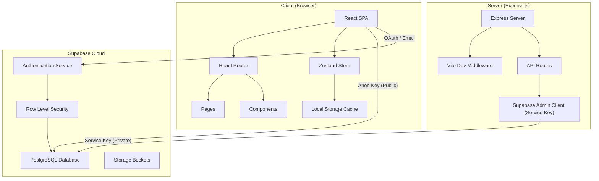
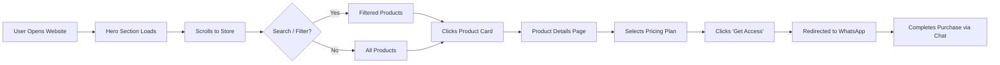
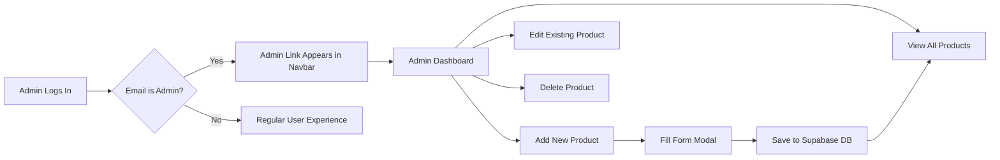

# 🎓 SP Tech Solutions — Detailed Project Explanation

> **Project Title:** SP Tech Solutions — AI & Software Showcase Platform  
> **Project Type:** Full-Stack Web Application  
> **Domain:** E-Commerce / Software-as-a-Service (SaaS) Marketplace

---

## 1. 📌 Problem Statement

In today's digital world, there are hundreds of AI tools and software products available — ChatGPT, Canva, Grammarly, etc. — but users often struggle to:
- **Discover** the right tool for their specific needs
- **Compare** features and pricing across products
- **Trust** unknown software providers
- **Purchase** software subscriptions easily from a single platform

**SP Tech Solutions** solves this by providing a **curated, premium software showcase platform** where users can browse, search, compare, and purchase AI tools and software solutions — all through a single, beautiful storefront.

---

## 2. 🎯 Objectives

| # | Objective |
|---|-----------|
| 1 | Build a modern, responsive web application to showcase and sell software products |
| 2 | Implement user authentication with multiple login methods (Email, Google OAuth, Magic Link) |
| 3 | Create a dynamic admin panel for managing the product inventory without code changes |
| 4 | Integrate a real-time database (Supabase) for dynamic product management |
| 5 | Implement a tiered pricing model with multiple validity periods (1 month, 3 months, 6 months, 1 year, lifetime) |
| 6 | Provide search & filter capabilities to help users find products easily |
| 7 | Deliver a premium, animated UI/UX experience using modern frontend technologies |
| 8 | Integrate WhatsApp as a direct customer support and checkout channel |

---

## 3. 🛠️ Technology Stack

### Frontend
| Technology | Purpose | Version |
|------------|---------|---------|
| **React** | UI component library (SPA framework) | 19.0 |
| **TypeScript** | Type-safe JavaScript for better code quality | 5.8 |
| **Vite** | Lightning-fast build tool & dev server | 6.2 |
| **TailwindCSS** | Utility-first CSS framework for responsive styling | 4.1 |
| **Framer Motion** | Declarative animation library for React | 12.x |
| **GSAP** | Professional-grade animation engine (ScrollTrigger, 3D transforms) | 3.15 |
| **Zustand** | Lightweight global state management | 5.0 |
| **React Router DOM** | Client-side routing (SPA navigation) | 6.30 |
| **Lucide React** | Modern open-source icon library | Latest |

### Backend
| Technology | Purpose |
|------------|---------|
| **Express.js** | Node.js HTTP server for API routes |
| **Supabase** | Backend-as-a-Service (PostgreSQL database + Auth + Storage) |
| **Supabase Auth** | Authentication service (Google OAuth, Email/Password, Magic Link) |
| **Supabase RLS** | Row Level Security for database access control |

### DevOps / Hosting
| Technology | Purpose |
|------------|---------|
| **Vercel** | Serverless deployment & hosting |
| **Git / GitHub** | Version control |
| **dotenv** | Environment variable management |

---

## 4. 🏗️ System Architecture



### Architecture Explanation

The application follows a **hybrid architecture**:

1. **Client-Side (SPA):** The React app runs in the browser. It uses the Supabase **anon (public) key** to directly read products and handle user authentication. This is safe because Supabase enforces **Row Level Security (RLS)** — users can only do what security policies allow.

2. **Server-Side (Express):** A lightweight Node.js/Express server serves the frontend and holds the **Supabase Service Key** (admin key). This key bypasses RLS and is **NEVER** exposed to the browser. It's used for sensitive admin operations.

3. **Database (Supabase/PostgreSQL):** Products, users, and all data live in a cloud-hosted PostgreSQL database managed by Supabase.

> [!IMPORTANT]
> The Service Key is kept server-side only. The frontend uses the Anon Key, ensuring security through RLS policies.

---

## 5. 📁 Project File Structure

```
Software-Solution/
├── index.html              # Entry HTML (loads React app)
├── server.ts               # Express.js backend server
├── vite.config.ts          # Vite build configuration
├── package.json            # Dependencies & scripts
├── vercel.json             # Vercel deployment config
├── firestore.rules         # Security rules (legacy Firebase reference)
├── logo.jpeg               # Brand logo
├── .env                    # Environment variables (secrets)
│
├── src/
│   ├── main.tsx            # React entry point
│   ├── App.tsx             # Root component with routing
│   ├── index.css           # Global styles
│   │
│   ├── pages/              # Full page components (routes)
│   │   ├── HomePage.tsx        # Landing page (hero + marquee + store + reviews)
│   │   ├── StorePage.tsx       # Product catalog with search & filters
│   │   ├── ProductDetails.tsx  # Individual product page with pricing plans
│   │   ├── AdminPage.tsx       # Admin dashboard (CRUD for products)
│   │   ├── ProfilePage.tsx     # User profile page
│   │   ├── AboutPage.tsx       # Company information
│   │   ├── PrivacyPolicyPage.tsx
│   │   ├── TermsOfServicePage.tsx
│   │   ├── DisclaimerPage.tsx
│   │   └── LegalPage.tsx
│   │
│   ├── components/         # Reusable UI components
│   │   ├── Layout.tsx          # App shell (navbar + footer + page transitions)
│   │   ├── ProductCard.tsx     # Product card with 3D tilt effect
│   │   ├── SearchPanel.tsx     # Search bar with typewriter + category filters
│   │   ├── Reviews.tsx         # Customer testimonials section
│   │   └── LoginModal.tsx      # Authentication modal (login/signup)
│   │
│   ├── store/              # Global state management
│   │   └── useProductStore.ts  # Zustand store for products
│   │
│   ├── context/            # React Context providers
│   │   ├── AuthContext.tsx     # Authentication state & methods
│   │   └── ThemeContext.tsx    # Dark/Light theme toggle
│   │
│   ├── lib/                # Utility libraries
│   │   ├── supabase.ts        # Supabase client initialization
│   │   └── utils.ts           # Helper functions (cn utility)
│   │
│   ├── data/               # Static/fallback data
│   │   └── products.ts        # Hardcoded product catalog (fallback)
│   │
│   └── types/              # TypeScript type definitions
│       └── index.ts           # Product & Category interfaces
```

---

## 6. 🔄 Application Flow / How It Works

### 6.1 User Journey



### 6.2 Admin Journey



---

## 7. ✨ Feature-by-Feature Breakdown

### 7.1 🏠 Home Page (`HomePage.tsx`)

| Feature | Implementation |
|---------|---------------|
| **Animated Hero Section** | GSAP `staggered reveal` animations with gradient aura background |
| **Moving Partner Marquee** | 3 rows of tech company logos (ChatGPT, Figma, Canva, etc.) scrolling infinitely in alternating directions using CSS `@keyframes` |
| **Embedded Store** | The `StorePage` component is directly embedded for seamless scrolling |
| **Customer Reviews** | `Reviews` component shows global testimonials |
| **WhatsApp Floating Button** | Persistent floating action button with animated chat bubble; auto-hides after 8 seconds |

### 7.2 🛒 Store Page (`StorePage.tsx`)

| Feature | Implementation |
|---------|---------------|
| **Search with Typewriter Effect** | Animated placeholder cycles through terms like "Search AI research...", "Find productivity software..." |
| **Category Filter Pills** | 8 categories: All, AI & Writing, Graphic Design, Video Editing, SEO & Marketing, Learning, Stock & Media, Entertainment |
| **Stats Dashboard** | Animated counters showing "100% Verified Tools", "4.8★ Rating", "24/7 Support", product count |
| **Trending Section** | Highlighted products marked as `is_trending` in the database |
| **Lazy Loading Grid** | Shows 6 products initially; "View More" button expands with smooth CSS transition |
| **Real-time Data** | Products fetched from Supabase on mount; cached in Zustand + localStorage |

### 7.3 📦 Product Details Page (`ProductDetails.tsx`)

| Feature | Implementation |
|---------|---------------|
| **Dynamic Routing** | URL pattern `/product/:id` — product fetched by ID from cache or Supabase |
| **Video/Image Player** | Supports YouTube, Vimeo embeds, and static image fallback |
| **5-Tier Pricing Selector** | Interactive plan buttons: 1 Month, 3 Months, 6 Months, 1 Year, Lifetime — each with unique color |
| **Features & Benefits Cards** | Two-column grid showing product features (✅ checkmarks) and benefits (● bullets) |
| **WhatsApp CTA** | "Get Access" button opens WhatsApp with pre-filled message including selected plan and price |
| **Smart Logo Resolution** | Auto-detects if `url` is a domain (uses logo.dev API) or direct image URL |

### 7.4 🔐 Authentication System (`AuthContext.tsx` + `LoginModal.tsx`)

| Feature | Implementation |
|---------|---------------|
| **Email/Password Login** | Standard Supabase auth with form validation |
| **Google OAuth** | One-click Google sign-in via `supabase.auth.signInWithOAuth()` |
| **Magic Link** | Passwordless login — sends a one-time link to user's email |
| **Sign Up** | Creates new account with display name; sends verification email |
| **Role-Based Access** | Admin role checked by comparing email against hardcoded admin emails |
| **Session Persistence** | Supabase auto-refreshes JWT tokens; session survives page reloads |

### 7.5 ⚙️ Admin Dashboard (`AdminPage.tsx`)

| Feature | Implementation |
|---------|---------------|
| **Protected Route** | Redirects non-admin users to home page via `<Navigate to="/" />` |
| **Dashboard Stats** | Shows Total Deployments, System Health (99.9%), Active Queries |
| **Product Grid** | All products displayed as cards with image, title, category, price |
| **Create Product** | Modal form with: title, category (preset + custom), description, base price, validity prices, image URL, video URL, logo domain, trending toggle, features array, benefits array |
| **Edit Product** | Same modal pre-filled with existing product data |
| **Delete Product** | Two-step confirmation: click delete → confirm "Purge!" |
| **Supabase CRUD** | Direct `supabase.from('products').insert/update/delete` calls |

### 7.6 🧭 Layout & Navigation (`Layout.tsx`)

| Feature | Implementation |
|---------|---------------|
| **Floating Pill Navbar** | Centered pill-shaped navbar on desktop; full-width on mobile |
| **Scroll Progress Bar** | Thin blue progress bar at top of page (Framer Motion `useScroll`) |
| **GSAP Scroll Effects** | Navbar shadow intensifies on scroll using `ScrollTrigger` |
| **Page Transitions** | Fade-in/out animations between route changes using `AnimatePresence` |
| **Responsive Footer** | Dark footer with company info, navigation links, legal links, social icons |
| **Hash Navigation** | Smooth scroll to `#store` section from any page |

### 7.7 🎴 Product Card (`ProductCard.tsx`)

| Feature | Implementation |
|---------|---------------|
| **3D Tilt Effect** | GSAP-powered `rotateX/rotateY` on mouse move — card tilts toward cursor |
| **Cursor Glow** | Radial gradient light follows cursor position on hover |
| **Staggered Entrance** | Cards animate in with staggered delay based on grid position |
| **Star Rating** | Deterministic rating (4.5–4.9) generated from product ID hash |
| **Shimmer CTA Button** | "Checkout" button has a sweeping white shimmer animation on hover |

### 7.8 🔍 Search Panel (`SearchPanel.tsx`)

| Feature | Implementation |
|---------|---------------|
| **Typewriter Placeholder** | Cycles through search suggestions with typing/deleting animation |
| **Glow Effect** | Gradient blur behind search bar that intensifies on focus |
| **Category Pills** | Spring-animated filter buttons with icons for each category |
| **Real-time Filtering** | Filters products as user types (no submit needed) |

### 7.9 ⭐ Reviews Section (`Reviews.tsx`)

| Feature | Implementation |
|---------|---------------|
| **International Reviewers** | 6 diverse reviewers with real Unsplash photos, names, roles |
| **Star Rating Component** | Supports full, half, and empty stars (e.g., 4.7 shows 4 full + 1 half) |
| **Average Rating Pill** | Calculates and displays overall average rating |
| **Expand/Collapse** | Shows 3 reviews initially; "View All" expands remaining with smooth transition |

---

## 8. 🗄️ Database Design (Supabase / PostgreSQL)

### Products Table

| Column | Type | Description |
|--------|------|-------------|
| `id` | UUID (Primary Key) | Auto-generated unique identifier |
| `title` | TEXT | Product name |
| `description` | TEXT | Detailed product description |
| `category` | TEXT | Product category (e.g., "AI & Writing") |
| `price` | NUMERIC | Base price in ₹ |
| `price_1m` | NUMERIC | 1-month subscription price |
| `price_3m` | NUMERIC | 3-month subscription price |
| `price_6m` | NUMERIC | 6-month subscription price |
| `price_1y` | NUMERIC | 1-year subscription price |
| `price_lifetime` | NUMERIC | Lifetime access price |
| `image` | TEXT | Product cover image URL |
| `url` | TEXT | Domain for logo (e.g., "canva.com") |
| `videoUrl` | TEXT | YouTube/Vimeo video URL |
| `features` | JSON Array | List of product features |
| `benefits` | JSON Array | List of product benefits |
| `is_trending` | BOOLEAN | Whether to show in "Trending" section |
| `created_at` | TIMESTAMP | Auto-generated creation timestamp |

---

## 9. 🔒 Security Measures

| Security Layer | Implementation |
|----------------|----------------|
| **API Key Separation** | Anon Key (public, browser-safe) vs Service Key (server-only, never exposed) |
| **Row Level Security (RLS)** | Supabase policies control who can read/write data |
| **Admin Verification** | Admin emails hardcoded in `AuthContext.tsx`; server-side admin client uses service key |
| **Environment Variables** | Secrets stored in `.env` file, not committed to Git |
| **CORS/Origin** | OAuth redirect URL restricted to `window.location.origin` |
| **Input Validation** | Form fields use HTML5 `required` attributes + TypeScript type checking |

---

## 10. 🎨 UI/UX Design Highlights

| Design Element | Technique |
|----------------|-----------|
| **Glassmorphism** | `backdrop-blur-md`, semi-transparent backgrounds (`bg-white/80`) |
| **Micro-animations** | Hover effects, scale transitions, cursor glow, shimmer sweeps |
| **3D Transforms** | GSAP `rotateX/rotateY` on product cards and stats panels |
| **Dark/Light Sections** | Hero and details pages use light theme; Store uses dark gradient theme |
| **Responsive Design** | Mobile-first with `sm:`, `md:`, `lg:` Tailwind breakpoints |
| **Marquee Animation** | Infinite-scrolling partner logos using CSS keyframes |
| **Scroll-triggered Reveals** | GSAP `ScrollTrigger` fades sections in as user scrolls |
| **Typography** | Google Fonts: Poppins, Plus Jakarta Sans for premium feel |

---

## 11. ⚡ Performance Optimizations

| Optimization | Implementation |
|--------------|----------------|
| **Code Splitting** | `React.lazy()` for all secondary pages — only HomePage loads initially |
| **Manual Chunk Splitting** | Vite config splits vendor (React), animations (GSAP/Motion), Supabase, and Zustand into separate cacheable bundles |
| **LocalStorage Caching** | Zustand `persist` middleware caches products in localStorage for instant reloads |
| **Image Optimization** | Unsplash images loaded with `?w=600&fit=crop&q=75` for smaller sizes |
| **Lazy Loading** | Images use `loading="lazy"` and `decoding="async"` attributes |
| **DNS Prefetch** | `<link rel="dns-prefetch">` for external image domains |
| **Will-Change Hints** | CSS `will-change: transform` on animated elements for GPU acceleration |

---

## 12. 🚀 How to Run the Project

```bash
# 1. Clone the repository
git clone <repo-url>
cd Software-Solution

# 2. Install dependencies
npm install

# 3. Set up environment variables (.env file)
VITE_SUPABASE_URL=<your-supabase-url>
VITE_SUPABASE_ANON_KEY=<your-anon-key>
SUPABASE_SERVICE_KEY=<your-service-key>
VITE_LOGO_DEV_PUBLIC_KEY=<your-logo-dev-key>

# 4. Start development server
npm run dev
# Server starts at http://localhost:3000

# 5. Build for production
npm run build
```

---

## 13. 🌐 Deployment

The project is configured for **Vercel** deployment:
- `vercel.json` handles routing configuration
- Environment variables are set in Vercel dashboard
- Build command: `npm run build`
- Output directory: `dist/`

---

## 14. 🔮 Future Scope / Enhancements

| Enhancement | Description |
|-------------|-------------|
| **Payment Gateway** | Integrate Razorpay/Stripe for direct online payments |
| **User Reviews** | Allow logged-in users to submit their own reviews |
| **Wishlist/Favorites** | Save products to a personal wishlist |
| **Order History** | Track past purchases per user account |
| **AI Chatbot** | Gemini-powered assistant for product recommendations |
| **Email Notifications** | Automated emails for new products and offers |
| **Analytics Dashboard** | Track page views, clicks, conversion rates |
| **Multi-language** | Support Hindi, Marathi, and other languages |

---

## 15. 📊 Summary Table

| Aspect | Details |
|--------|---------|
| **Frontend** | React 19 + TypeScript + TailwindCSS + GSAP + Framer Motion |
| **Backend** | Express.js + Supabase (PostgreSQL + Auth) |
| **Authentication** | Google OAuth, Email/Password, Magic Link (via Supabase) |
| **State Management** | Zustand with localStorage persistence |
| **Routing** | React Router v6 with lazy loading |
| **Animations** | GSAP (3D tilt, scroll reveals) + Framer Motion (page transitions) |
| **Deployment** | Vercel (serverless) |
| **Security** | RLS policies, service key isolation, env variable protection |
| **Product Count** | Dynamic (managed via admin panel, stored in Supabase) |
| **Pricing Model** | 5-tier validity pricing (1M / 3M / 6M / 1Y / Lifetime) |
| **Checkout** | WhatsApp-based (direct messaging with pre-filled order details) |

---

> [!TIP]
> **Key Talking Points for your teacher:**
> 1. This is a **full-stack** project with both frontend and backend
> 2. It uses **real-world technologies** (React, TypeScript, Supabase, Vercel)
> 3. It has **role-based access control** (regular users vs admins)
> 4. The admin can manage products **without touching code** — everything is through a UI
> 5. The app is **production-ready** with performance optimizations, security measures, and responsive design
> 6. The **5-tier pricing model** mimics real SaaS platforms like Netflix or Adobe
> 7. WhatsApp integration provides a **real customer support channel**
